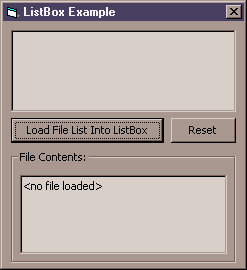



## How to Load Files from a ListBox

### Description

This simple code demonstrates how to load a list of files into a standard list box, and then display the contents of a file when it is selected from the list.
 
### More Info
 

             |
---                |---
**Submitted On**   |2000-12-22 11:24:50
**By**             |[Daniel S\. Soper](https://github.com/Planet-Source-Code/PSCIndex/blob/master/ByAuthor/daniel-s-soper.md)
**Level**          |Beginner
**User Rating**    |4.3 (17 globes from 4 users)
**Compatibility**  |VB 6\.0
**Category**       |[Files/ File Controls/ Input/ Output](https://github.com/Planet-Source-Code/PSCIndex/blob/master/ByCategory/files-file-controls-input-output__1-3.md)
**World**          |[Visual Basic](https://github.com/Planet-Source-Code/PSCIndex/blob/master/ByWorld/visual-basic.md)
**Archive File**   |[CODE\_UPLOAD1294012222000\.zip](https://github.com/Planet-Source-Code/daniel-s-soper-how-to-load-files-from-a-listbox__1-13791/archive/master.zip)

